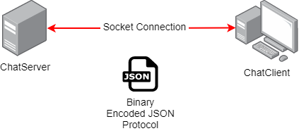

# ChatServer

Java Chat Server und Client

Features:
+ Direct Messages
+ Brodcast Messages
+ Online Status
+ List Online Users

## Funktion
Server komponente ist zuständig für das Empfangen und den weiterversand von erhalteten Nachrichten und das Tracken und speichern der aktuell angemeldeten Usern.

Der Client ist für das Anzeigen der User / Nachrichten und für den Versand von neuen Nachrichten verantworlich.
Dabei fungiert der Client ebenfalls als Server, da dieser über einen Server Socket die Nachrichten vom Server (Cleint Socket) erhält.

